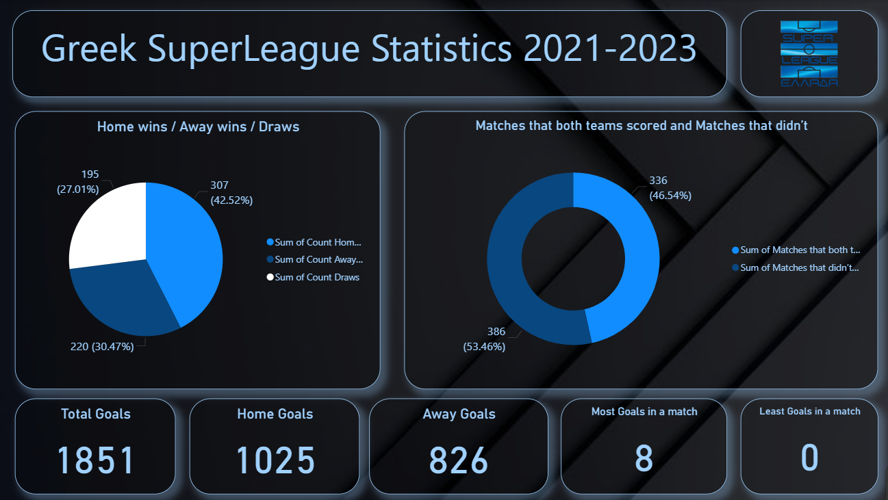

# Greek SuperLeague Statistics 2021-2023

This project fetches football data from the Super League Greece (2021 - 2023) API, processes it into a clean CSV format, and visualizes key statistics in an interactive Power BI dashboard.


---
## Table of Contents
- [Project Workflow](#project-workflow)
- [Screenshots](#screenshots)
- [API Documentation](API_DOCS.md)
- [Main Python Libraries Used](#main-python-libraries-used)
- [Future Improvements](#future-improvements)
- [Installation & Usage](#installation--usage)


---
## Project Workflow
1. **Data Fetching**
   - Uses API key to request Super League Greece data from 2021 - 2023 seasons.
   - Converts JSON response to CSV.

2. **Data Cleaning**
   - CSV is processed in Excel for:
     - Removing null/duplicate rows.
     - Adding calculated columns (Total Goals, Home/Away points, etc.).
     - Formatting for Power BI.

3. **Visualization**
   - Cleaned Excel data is imported into Power BI.
   - Interactive dashboard is created to display:
     - Team performance (Wins, Draws, Losses).
     - Least & most goals in a match.
     - Home/Away goals and other metrics.


---
## Screenshots



---
## API Documentation

For more detailed API usage and examples, please see the API_DOCS.md file.


---
## Main Python Libraries Used

**Requests** – API requests.  
**CSV** – Save and manage data in CSV file.  
**Time** – Time delay between API calls.


---
## Future Improvements

- Season and team-based analysis.
- Deeper team statistics presented.
- Basic prediction models.
- Dynamic Power BI dashboards.


---
## Installation & Usage
### Clone the Repository
```bash
git clone https://github.com/timosvar/Greek-Superleague-Statistics.git
cd Greek_Superleague_Stats
```
